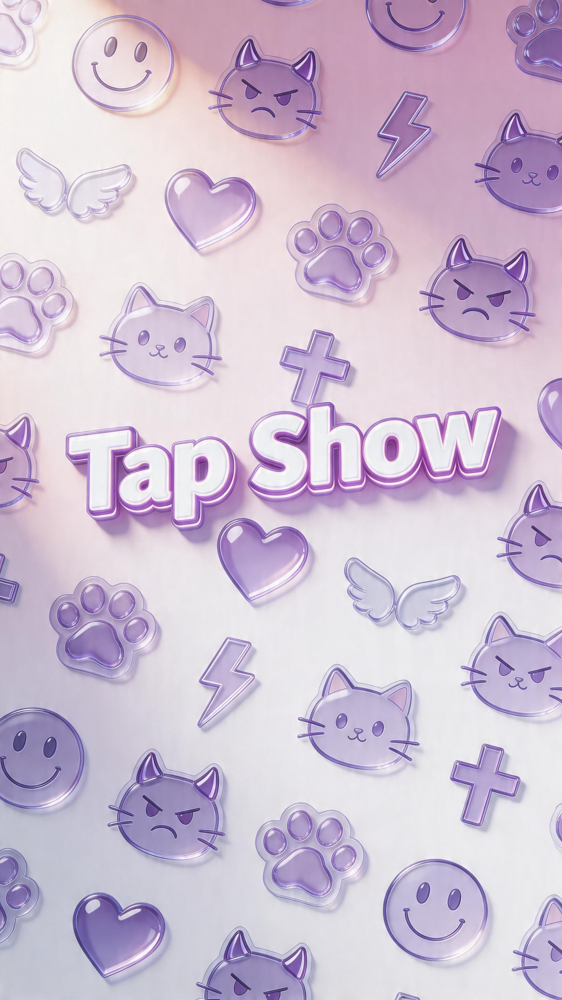

# TapShow

TapShow 是一个围绕「拍照定格 + 简笔画标注 + AI 生成贴图 + 实时挂载预览」构建的 H5 原型。  
项目目前已经具备单人创作闭环，并实现了同一局域网/热点环境下的双人房间、互相抓取画面、互相画草图、互相生成并发送贴图的基础链路。



## Demo

README 内使用 GIF 展示核心交互，完整录屏来自项目宣传视频裁切版。


## 项目定位

TapShow 的目标不是传统滤镜应用，而是一个更轻量、更直接的「视频创作贴图引擎」：

- 用户先通过摄像头拍下一帧作为底图
- 在底图上直接画简笔草图
- 将草图送入图像生成模型，得到多个候选贴图
- 把贴图挂载回实时视频预览
- 支持保存贴图、模板、照片
- 在双人模式下，A 和 B 可以互相抓取对方画面、互相标注、互相生成贴图并发送给对方挂载

## 当前能力

### Tab1 单人创作

- 自动打开摄像头
- 拍照后冻结底图
- 在同一画布上直接画草图
- 生成 3 张候选贴图
- 贴图挂载到实时视频预览
- 保存贴图 / 模板 / 照片

### Tab2 双人互动

- 同一房间内创建 / 加入
- 本地实时视频预览
- 发送当前画面给对方
- 拉取对方冻结帧
- 在对方冻结帧上画草图
- 为对方生成候选贴图
- 选择候选后发送给对方
- 对方收到后在本地视频上挂载

### Tab3 资产库

- 展示模板
- 展示已保存资产

## 典型流程

### 单人模式

1. 打开页面，自动请求摄像头权限
2. 点击 `拍照`
3. 在底图上画草图
4. 点击 `生成贴图`
5. 从 3 张候选中选择一张
6. 在右侧实时视频上预览挂载效果
7. 保存贴图 / 模板 / 照片

### 双人模式

1. A 创建房间
2. B 输入房间号加入
3. A 或 B 打开本地视频，并发送自己的当前画面
4. 对方点击 `拉取对方画面`
5. 在对方冻结帧上画草图
6. 点击 `给对方生成贴图`
7. 从候选中选中一张并 `发送当前候选`
8. 目标端收到贴图后，在自己的本地视频上挂载

## 技术栈

### 前端

- 原生 HTML / CSS / JavaScript
- MediaPipe Face Landmarker
- WebRTC 信令骨架与局域网双人视频

### 后端

- Python 标准库 HTTP Server
- JSON 文件存储房间、画布、模板和资产
- 图像生成接口调用

### 视觉风格

- High-Fidelity Claymorphism
- 圆角、大面积柔和阴影、半透明磨砂卡片

## 目录结构

```text
E:\AI
├─ app.py
├─ bg_remove.py
├─ model_config.json
├─ HANDOFF.md
├─ test_app.py
├─ static
│  ├─ index.html
│  ├─ app.js
│  └─ styles.css
├─ docs
│  ├─ tapshow-cover.png
│  └─ tapshow-demo.gif
├─ data
└─ certs
```

## 运行方式

```bash
python app.py
```

默认会同时启动：

- HTTP: `http://127.0.0.1:8000`
- HTTPS: `https://<局域网IP>:8443`

如果要测试双人房间，建议两台设备都访问同一个 HTTPS 局域网地址。

## 模型配置

统一配置文件：

- `model_config.json`

示例：

```json
{
  "base_url": "https://ark.cn-beijing.volces.com/api/v3/images/generations",
  "api_key": "",
  "model": "doubao-seedream-5-0-260128"
}
```

说明：

- `api_key` 建议本地填写，不要把真实密钥提交到仓库
- 当前代码优先读取 `model_config.json`
- 也兼容 `.ark_api_key` 这类本地文件

## 说明文档来源

本次 README 结合了：

- 当前 TapShow 项目的实际实现状态
- `飞书文档CL` 中的角色分工信息
  - 研发：ZC
  - 海报：CX
  - 视频：YJ

## 当前状态

项目现在是一个可运行的原型工程，重点已经不在静态页面展示，而是：

- 单人生成链路可跑通
- 双人房间链路已搭好
- 双端互相画草图、互相生成、互相挂载的主流程已进入联调阶段

后续如果继续推进，最值得做的是：

- 双人挂载预览进一步稳定
- 贴图绑定从人脸扩展到身体更多部位
- 候选贴图和资产体系继续完善

